# Programming assignment 

- [Programming assignment](#programming-assignment)
  - [1. Performance Metrics:](#1-performance-metrics)
  - [2. Experiment setup and omp algorithm:](#2-experiment-setup-and-omp-algorithm)
  - [3. Noiseless case:](#3-noiseless-case)
  - [4. Noisy case:](#4-noisy-case)
    - [4.1 Noisy case with sparsity $s$ is known](#41-noisy-case-with-sparsity-s-is-known)
    - [4.2 Noisy case with sparsity $s$ is unknown and $||n||_2$ is known.](#42-noisy-case-with-sparsity-s-is-unknown-and-n_2-is-known)
  - [5. Decode a Compressed Signal](#5-decode-a-compressed-signal)
    - [5(a) Can You Guess?](#5a-can-you-guess)
    - [5(b) Recover the Signal](#5b-recover-the-signal)
    - [5(c) Analysis](#5c-analysis)
    - [5(d) Guess the Meaning of the picture](#5d-guess-the-meaning-of-the-picture)

This is the report of the programming assignment: Finding sparse solution via Orthogonal Matching Pursuit (OMP). I recommend to read it in .html format (so you can easily link to the code). PDF version is also available.

## 1. Performance Metrics: 
Normalized Error is calculated in function 'normalized_error' in [omp.py](omp.py)

```python
def normalized_error(x, x_):
    return norm(x - x_, ord=2) / norm(x, ord=2)
```


## 2. Experiment setup and omp algorithm:
Experiments setup and omp algorithm are in [omp.py](omp.py)

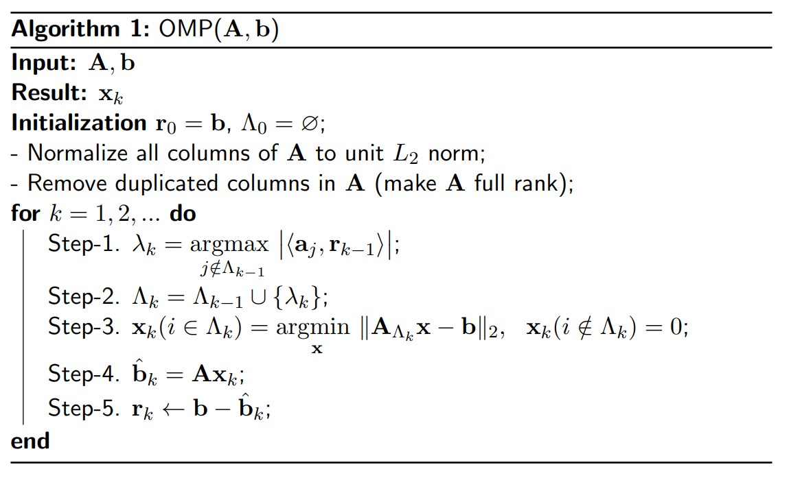
+ OMP algorithm pesudo code

<br />

```python
def OMP(A, y, iteration, acc_tolerance=0.001):
    """
    Orthogonal Matching pursuit algorithm
    :input A: measurement matrix M*N
    :input y: measurement vector M*1
    :output x: sparse vector  N*1
    """
    r = y    # initialize the residual as y
    M, N = A.shape
    x = np.zeros(N)
    Lambdas = []
    i = 0
    # Control stop interation with norm thresh or sparsity

    while norm(r, ord=2) > acc_tolerance and i < iteration:
        scores = A.T.dot(r)  # Compute the score of each atoms
        Lambda = np.argmax(abs(scores))  # Select the atom with the max score
        Lambdas.append(Lambda)
        An = A[:, Lambdas]  # All selected atoms form a basis

        # least square solution: x = (A^T A)^(-1) A^T y
        x[Lambdas] = np.linalg.pinv(An).dot(y)
        x = x.reshape(N, -1)
        r = y - A.dot(x)  # Calculate the residual
        i += 1
    return x
```
+ OMP algorithm in Python
  
<br />

## 3. Noiseless case:
The noiseless case is in [noiseless.py](noiseless.py). The experiment results are as follows:

We implement the OMP algorithm for 2000 times with the parameter required in 5.3, with random realizations of A. The noiseless transition map of this scenario is shown below: （color value refers to the success rate）

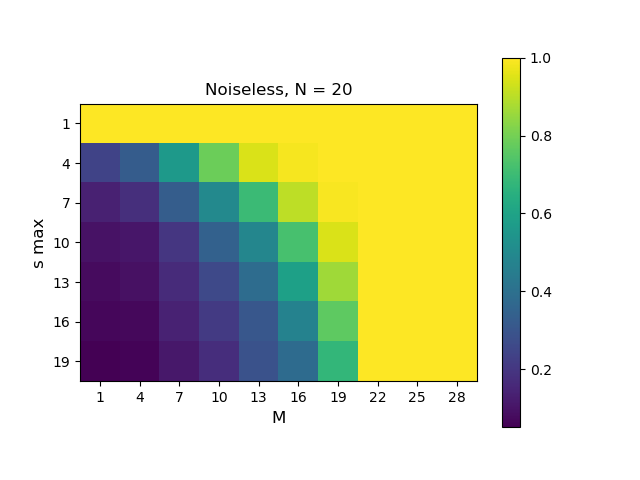

+ N = 20, M from 1 to 30, s from 1 to 20, both with an interval of 3

<br />

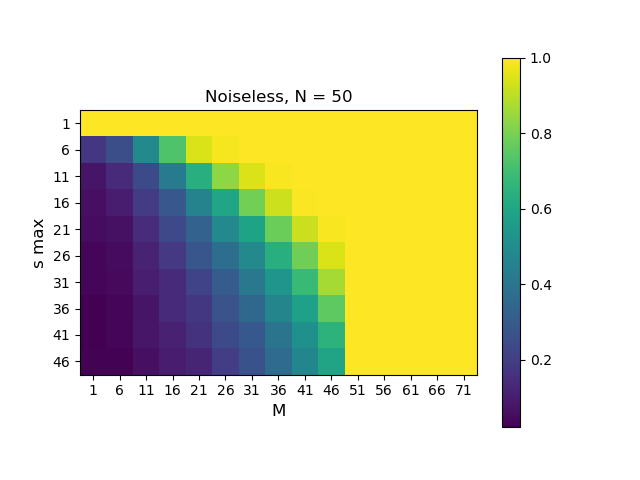
+ N = 50, M from 1 to 75, s from 1 to 50, both with an interval of 5

<br />

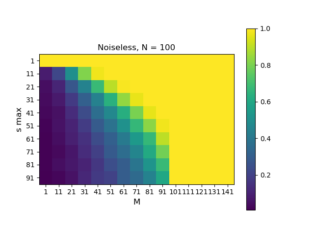
+ N = 100, M from 1 to 150, s from 1 to 100, both with an interval of 10

<br />

As shown in the figures above, the performance of OMP algorithm is better with the increase of M and decrease of s, which shows that the OMP algorithm prefers sparse matrix s. What's more, we can observe an obvious change near $M=N$, over which the OMP algorithm will remain an 100% success rate.

<br />

## 4. Noisy case: 
we input parameter 'know_s=True' or 'know_s=False' to distinguish the two requirements. Detailed implementation can be viewed in the code files.

### 4.1 Noisy case with sparsity $s$ is known
The noisy case with sparsity s is known is written in code file [under_noise1.py](under_noise1.py). Here we run cases with N = 20, 50, 100. And we test the OMP with two different noises: 1e-2 and 1e-5. Considered that OMP algorithm is a sparse solver, we choose s = N // 10. The transition maps of success rate regarding noise and M are shown in figure 4.1.
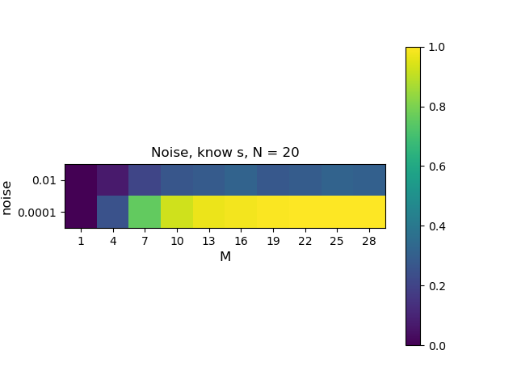
+ N = 20, M = [1, 20, 3], noise = 1e-2, 1e-4

<br />

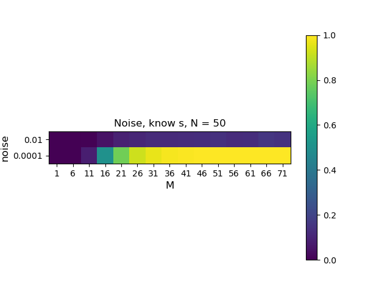
+ N = 20, M = [1, 50, 3], noise = 1e-2, 1e-4

<br />

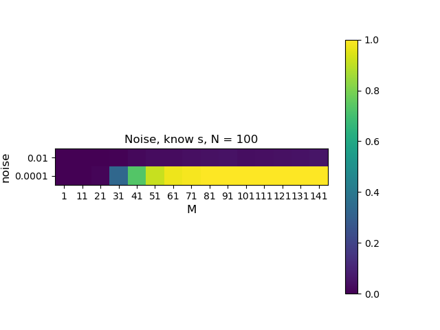
+ N = 100, M = [1, 100, 5], noise = 1e-2, 1e-4

<br />

### 4.2 Noisy case with sparsity $s$ is unknown and $||n||_2$ is known.
The noisy case with sparsity s is unknown and $||n||_2$ is known is written in code file [under_noise2.py](under_noise2.py). Here we run cases with N = 20, 50, 100. And we test the OMP with two different noises: 1e-2 and 1e-5. Considered that OMP algorithm is a sparse solver, we choose s_max = N // 10. The transition maps of success rate regarding noise and M are shown in figure 4.2.

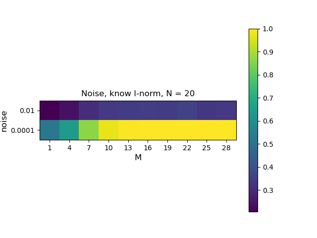
+ N = 20, M = [1, 20, 3], noise = 1e-2, 1e-4
  

<br />

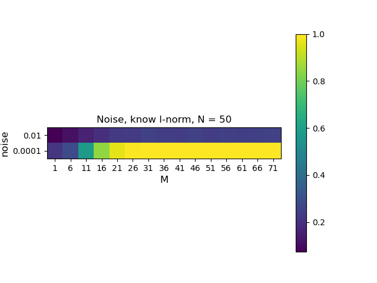
+ N = 20, M = [1, 75, 5], noise = 1e-2, 1e-4

<br />

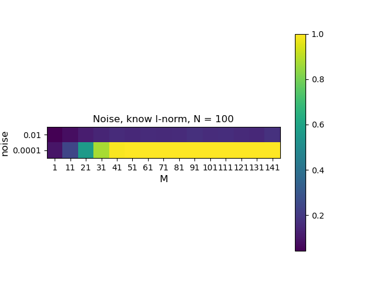
+ N = 100, M = [1, 150, 10], noise = 1e-2, 1e-4

<br />

Both 4.1 and 4.2 show that the successful rate increase with the decrease of noise and increase of M. Under large noise cases, even with $M > N$ we can not achieve a good success rate.


## 5. Decode a Compressed Signal
We implement this part with the 'omp.py' function we write in [omp.py](omp.py). Implementation is in [decode_message.py](decode_message.py)
### 5(a) Can You Guess?
Unfortunately, No.

### 5(b) Recover the Signal
We recovered the original signal from $Y_1, Y_2, Y_3$ respectively and obtained the $X_1, X_2, X_3$. The results are shown below:

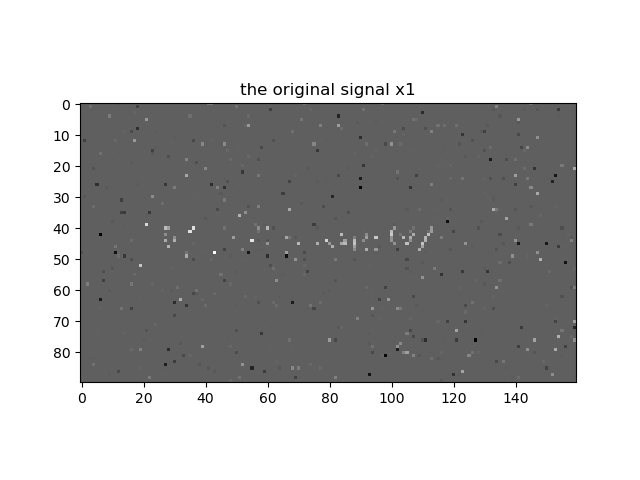
+ A1 size: (960, 14400); Y1 size: (960, 1); X1 size: (14400, 1)

<br />

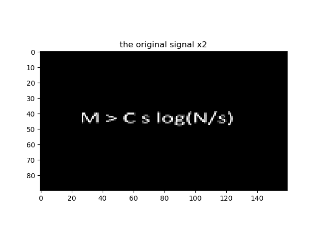
+ A2 size: (1440, 14400); Y2 size: (1440, 1); X2 size: (14400, 1)

<br />


+ A3 size: (2880, 14400); Y2 size: (2880, 1); X2 size: (14400, 1)

<br />

### 5(c) Analysis
We can see that the second and third figures are far more clear than the first one. Since in the second and third cases, the row number of matrix A is larger, and we have concluded empirically that the OMP algorithm works better under large M (row number) and small s(support size) condition. 

### 5(d) Guess the Meaning of the picture
The figure is a formula:
$$
 M > C_s log(N/s)
$$

This formula shows the same pattern as the experiments. For a larger N, you generally need a larger M to recover the x signal. 

Worth mentioning, this formula assembles resemble the Shannon theorom:

$$
C = Blog_2(1+S/N)
$$

I guess that the function is a theoretical bound of OMP/compressed sensing.